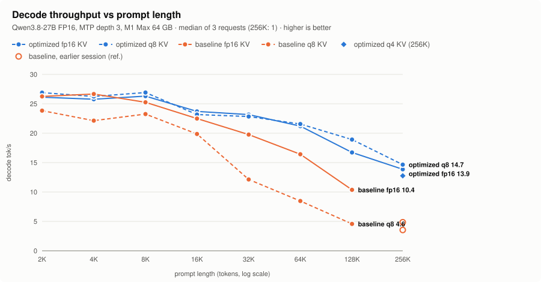
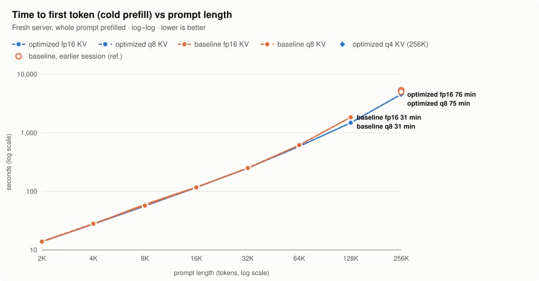
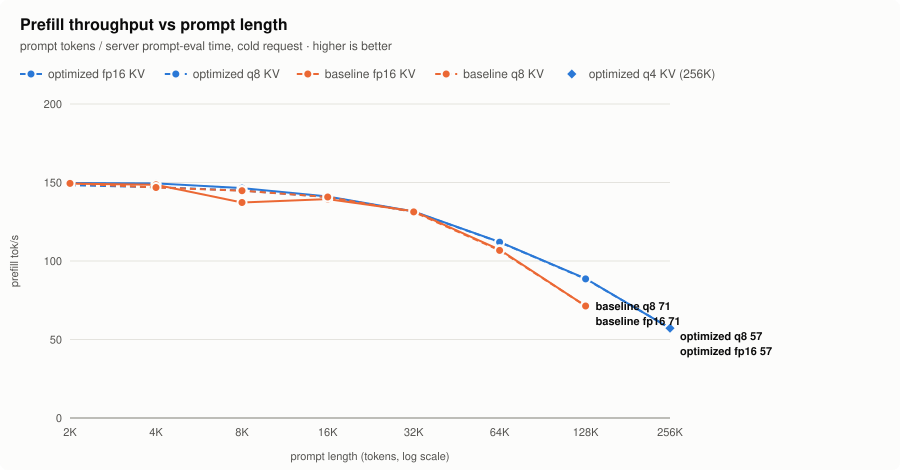
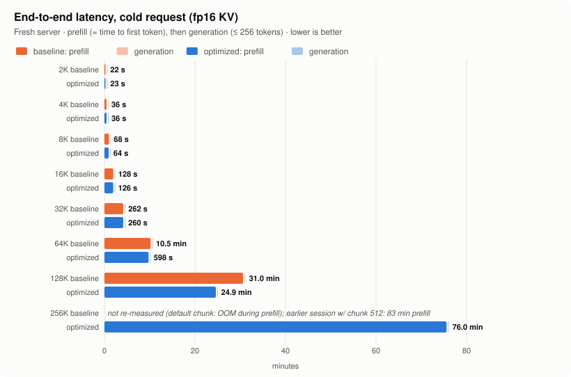
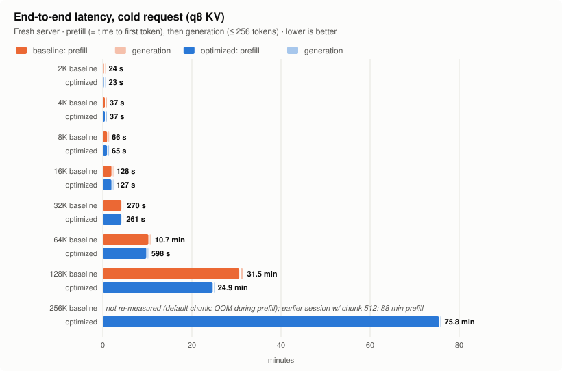
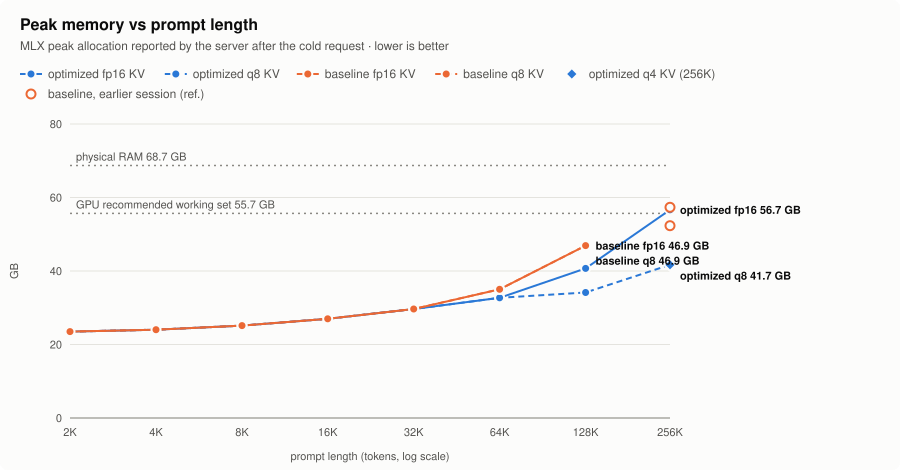

# MTPLX long-context benchmark on Apple M1 Max (2K → 256K)

English | [日本語](README.ja.md)

To run this branch's server yourself, see [Usage](../../m1max-longctx/USAGE.md).

Before/after measurement of the `m1max-longctx` branch against upstream MTPLX on a
MacBook Pro M1 Max with 64 GB, serving **Qwen3.8-27B-MTPLX-Optimized-Speed (FP16)**
with MTP depth 3 through MTPLX's own OpenAI-compatible HTTP server (`mtplx serve`). Both commits run with their default
settings. The branch changes switch themselves on for M1-family GPUs
(`applegpu_g13*`) only. The run took 8.6 hours for 31 cells on 25 September 2026.

**Highlights** (baseline → optimized):

- **Decode at 128K:** 10.4 → **16.7 tok/s** with fp16 KV (+61%), and 4.6 → **18.9 tok/s**
  with q8 KV (4.1×). From 32K up, q8 KV decode is 1.9–4.1× faster.
- **Cold time to first token at 128K:** 30.6 → **24.6 min** (−20%), from the MMA prefill
  attention. Up to 32K the prefill is unchanged (within ±1%, except 8K fp16 at +7%).
- **Peak memory at 128K:** 46.9 → **40.7 GB** (fp16 KV) and **34.1 GB** (q8 KV).
- **256K now works at default settings:** with q8 KV it decodes at **14.7 tok/s** after a
  75-minute prefill, with a peak of **41.7 GB**. At its defaults the baseline runs out of
  memory during a 256K prefill.
- **Short prompts:** up to 16K with fp16 KV, decode stays within −3% to +5% of the baseline.

| | commit | |
|---|---|---|
| **baseline** | [`1de2b1c`](https://github.com/youssofal/MTPLX/commit/1de2b1c049136ed117af0c6712baaadd81820b51) | upstream `main` (2.12.0 + README), defaults |
| **optimized** | [`66910a1`](https://github.com/shunya1810/MTPLX/commit/66910a1efd3c6ccc2e37414a8f8b3db608f7a04f) | `shunya1810/MTPLX` branch `m1max-longctx`, defaults |

## Decode throughput

<picture>
  <source media="(prefers-color-scheme: dark)" srcset="charts/decode-vs-context-dark.svg">
  
</picture>

## Time to first token and prefill

<picture>
  <source media="(prefers-color-scheme: dark)" srcset="charts/ttft-vs-context-dark.svg">
  
</picture>

<picture>
  <source media="(prefers-color-scheme: dark)" srcset="charts/prefill-vs-context-dark.svg">
  
</picture>

## End-to-end latency

The whole cold request: the prefill, then up to 256 generated tokens. From 128K up, the
prefill is 97–99.6% of the time, so for a single cold request the faster decode barely
shows. It pays off on follow-up turns, where the prefix cache skips the prefill and every
generated token runs at the decode rate.

<picture>
  <source media="(prefers-color-scheme: dark)" srcset="charts/e2e-off-dark.svg">
  
</picture>

<picture>
  <source media="(prefers-color-scheme: dark)" srcset="charts/e2e-q8-dark.svg">
  
</picture>

## Peak memory

<picture>
  <source media="(prefers-color-scheme: dark)" srcset="charts/peak-memory-vs-context-dark.svg">
  
</picture>

## All numbers

Each cell reads baseline → **optimized** (change). The CSV version is
[`results/summary.csv`](results/summary.csv), and every request's server metrics are in
[`results/raw-cells.jsonl`](results/raw-cells.jsonl).

### fp16 KV

| context | prompt tokens | prefill tok/s | TTFT (cold) | decode tok/s | E2E (cold) | peak memory | same output |
|---|---:|---:|---:|---:|---:|---:|:-:|
| 2K | 2,048 | 149.3 → **149.7** (+0%) | 13.9 s → **13.8 s** (-0%) | 26.26 → **26.12** (-1%) | 22.5 s → **22.5 s** (+0%) | 23.5 → **23.5 GB** | ✅ |
| 4K | 4,097 | 148.5 → **149.4** (+1%) | 27.7 s → **27.6 s** (-1%) | 26.66 → **25.78** (-3%) | 36.4 s → **36.5 s** (+0%) | 24.0 → **24.0 GB** | ✅ |
| 8K | 8,202 | 137.3 → **146.4** (+7%) | 59.9 s → **56.2 s** (-6%) | 25.26 → **26.30** (+4%) | 68.1 s → **64.1 s** (-6%) | 25.1 → **25.1 GB** | ✅ |
| 16K | 16,378 | 139.4 → **141.1** (+1%) | 118 s → **116 s** (-1%) | 22.49 → **23.71** (+5%) | 128 s → **126 s** (-1%) | 27.0 → **27.0 GB** | ✅ |
| 32K | 32,778 | 131.7 → **131.5** (-0%) | 249 s → **249 s** (+0%) | 19.77 → **23.16** (+17%) | 262 s → **260 s** (-1%) | 29.7 → **29.7 GB** | ✅ |
| 64K | 65,530 | 107.2 → **112.1** (+5%) | 10.2 min → **585 s** (-4%) | 16.42 → **21.20** (+29%) | 10.5 min → **598 s** (-5%) | 35.0 → **32.7 GB** | ✅ |
| 128K | 131,082 | 71.3 → **88.8** (+24%) | 30.6 min → **24.6 min** (-20%) | 10.36 → **16.72** (+61%) | 31.0 min → **24.9 min** (-20%) | 46.9 → **40.7 GB** | ❌ |
| 256K | 259,003 | <sub>ref.</sub> 51.8 → **57.1** | <sub>ref.</sub> 83.3 min → **75.6 min** | <sub>ref.</sub> 3.54 → **13.86** | **76.0 min** | <sub>ref.</sub> 57.3 → **56.7 GB** | — |

### q8 KV

| context | prompt tokens | prefill tok/s | TTFT (cold) | decode tok/s | E2E (cold) | peak memory | same output |
|---|---:|---:|---:|---:|---:|---:|:-:|
| 2K | 2,048 | 149.4 → **148.3** (-1%) | 13.9 s → **14.0 s** (+1%) | 23.84 → **26.90** (+13%) | 23.9 s → **22.9 s** (-4%) | 23.5 → **23.5 GB** | ✅ |
| 4K | 4,097 | 146.8 → **147.0** (+0%) | 28.1 s → **28.0 s** (-0%) | 22.13 → **26.25** (+19%) | 36.9 s → **36.9 s** (+0%) | 24.0 → **24.0 GB** | ❌ |
| 8K | 8,202 | 144.8 → **144.9** (+0%) | 56.8 s → **56.8 s** (-0%) | 23.26 → **26.92** (+16%) | 65.8 s → **64.6 s** (-2%) | 25.1 → **25.1 GB** | ✅ |
| 16K | 16,378 | 140.8 → **140.8** (+0%) | 117 s → **117 s** (-0%) | 19.87 → **23.17** (+17%) | 128 s → **127 s** (-1%) | 27.0 → **27.0 GB** | ❌ |
| 32K | 32,778 | 131.3 → **131.3** (+0%) | 250 s → **250 s** (-0%) | 12.13 → **22.83** (+88%) | 270 s → **261 s** (-4%) | 29.7 → **29.7 GB** | ✅ |
| 64K | 65,530 | 106.7 → **112.0** (+5%) | 10.2 min → **585 s** (-5%) | 8.47 → **21.56** (+155%) | 10.7 min → **598 s** (-7%) | 35.0 → **32.7 GB** | ✅ |
| 128K | 131,082 | 71.4 → **88.6** (+24%) | 30.6 min → **24.7 min** (-19%) | 4.57 → **18.92** (+314%) | 31.5 min → **24.9 min** (-21%) | 46.9 → **34.1 GB** | ❌ |
| 256K | 259,003 | <sub>ref.</sub> 48.8 → **57.2** | <sub>ref.</sub> 88.4 min → **75.4 min** | <sub>ref.</sub> 4.86 → **14.66** | **75.8 min** | <sub>ref.</sub> 52.3 → **41.7 GB** | — |

### q4 KV (optimized only, 256K)

| context | prompt tokens | prefill tok/s | TTFT (cold) | decode tok/s | E2E (cold) | peak memory |
|---|---:|---:|---:|---:|---:|---:|
| 256K | 259,003 | 57.2 | 75.5 min | 12.76 | 75.8 min | 41.7 GB |

<sub>ref. = the baseline was not re-measured at 256K. At its default prefill chunk
(2048) upstream runs out of memory about 48 minutes into a 256K prefill. The
reference values come from an earlier session with the chunk lowered to 512 by hand,
on an older commit and with a slightly different harness. They show the order of
magnitude only and are not a like-for-like comparison.</sub>

## Output parity

At temperature 0 the two commits produced byte-identical text for 12 of the 16
prompt/KV pairs. The other four diverge after a shared prefix:

| pair | first differing character |
|---|---:|
| 4K q8 | 5 |
| 16K q8 | 969 (of ~1,000) |
| 128K fp16 | 528 |
| 128K q8 | 127 |

The M1 kernels accumulate attention in a different order, so greedy decoding can flip
wherever the top two candidates are nearly tied. The same flip happens within one commit.
At 128K q8 the baseline's own cold request (full prefill) and warm request (prefix cache)
produced different texts, and the baseline's cold text is byte-identical to the optimized
commit's warm text. For these four pairs the E2E column compares slightly different output
lengths; decode tok/s is per token and is not affected.

## How it was measured

- **One fresh server per cell.** A cell is one commit × one prompt length × one KV
  mode. Each starts its own `mtplx serve` process, so no session cache or Metal
  allocator state carries over between cells. The SSD session cache is off, and
  cells are separated by a 60 s cooldown.
- **Requests.** The same streamed `/v1/chat/completions` request is sent 3 times
  (256K: once). It uses temperature 0 (`top_k` 1, fixed seed), thinking disabled
  and `max_tokens` 256.
  - **Request 1 is cold.** The whole prompt is prefilled. It gives TTFT, prefill,
    E2E and peak memory.
  - **Requests 2–3 are warm.** They reuse the RAM prefix cache, so prefill is
    skipped, but the KV length and the generated text are identical. They only add
    decode samples.
- **Prompt.** Deterministic synthetic telemetry records, trimmed to the target
  token count, followed by a fixed question
  (`scripts/bench_longctx.py: build_telemetry_prompt`). The "prompt tokens" column
  is the server's count after the chat template. The 256K row is 259,000 tokens so
  that the 256-token answer still fits the 262,144-token window.
- **Metrics.**
  - **TTFT (cold):** client wall clock from sending the request to the first
    streamed token.
  - **Prefill tok/s:** prompt tokens ÷ the server's `prompt_eval_time_s`.
  - **Decode tok/s:** the server's `decode_tok_s`, the median over the requests.
    It counts committed tokens, including MTP-accepted drafts, divided by decode
    wall time.
  - **E2E (cold):** client wall clock of request 1, from send to the last token.
  - **Peak memory:** the server's `peak_memory_bytes` (MLX peak allocation) after
    request 1. The physical RAM line is 68.7 GB (64 GiB). The GPU working-set line
    is Metal's `recommendedMaxWorkingSetSize` (55.7 GB), which is not the same limit.
- **Correctness.** The SHA-256 of the streamed text is compared across the requests
  of a cell and across the two commits for the same prompt and KV mode ("same
  output" column).

Environment details are in [`configs/environment.json`](configs/environment.json)
and [`configs/model.lock.json`](configs/model.lock.json).

### Limits

- The data comes from one machine, run once. Decode has 3 samples per cell (256K:
  1), and prefill and TTFT have 1 cold sample per cell.
- Cold TTFT at 2K–4K includes one-time costs of the first request (kernel
  compilation; the server starts with `--warmup-tokens 0`).
- Only single-stream latency was measured; concurrency and batching were not
  benchmarked.
- At 128K q8, request 3 missed the RAM prefix cache on both commits and prefilled
  again. Its decode sample is still valid.
- At 256K with fp16 KV the peak (56.7 GB) is slightly above Metal's recommended working
  set (55.7 GB). The request still completed.
- About 1.9 GB of swap was already in use before the run, and it did not grow during it.

## What changed on the branch

`git log --oneline 1de2b1c..66910a1`:

- `66910a1` Keep the dense MMA verify route off below a 4096-key capacity
- `f359091` MMA kernel: split the QK reduction into two accumulators for q8/q4 KV
- `ad87b04` Tests: MMA verify/prefill kernel numerics across layouts and bails
- `9e77f1c` Flash-style MMA prefill attention for long prefixes on M1
- `9ce0015` Tests: pin GPU-family gates, cover M1 chunk cap and pages-layout demote
- `e5d1e77` Cap the prefill chunk at 512 above 163,840 prompt tokens on M1
- `ba22a23` Route dense verify and MTP draft attention through the MMA kernel on M1
- `54afe35` GraphBank: lift the compiled-verify context fence for paged adapters on M1
- `439a460` M1 long-context: MMA split-K attention kernel and paged/quantized adapter fixes
- `1e33cfb` Long-context diagnostics: KV cache receipts, route trace, tail-mask elision for quantized adapter

## Reproduce

```bash
git clone https://github.com/shunya1810/MTPLX && cd MTPLX
git remote add upstream https://github.com/youssofal/MTPLX && git fetch upstream
git checkout m1max-longctx
cd docs/benchmarks/m1max-longctx
MTPLX_REPO=$(git rev-parse --show-toplevel) \
MODEL_PATH=~/.mtplx/models/Youssofal--Qwen3.8-27B-MTPLX-Optimized-Speed-FP16 \
MTPLX_PY="$HOME/Library/Application Support/MTPLX/runtime-venv/bin/python" \
WORK_DIR=/tmp/m1max-longctx-bench \
./run_matrix.sh            # add --only 8k-off-baseline 8k-off-optimized for a quick check
```

The run plan (cells, order, timeouts) is [`configs/plan.json`](configs/plan.json).
The full plan took 8.6 hours on this machine. `scripts/summarize.py`
regenerates `results/` and `charts/` from `results/raw-cells.jsonl`, using the
Python standard library only.
